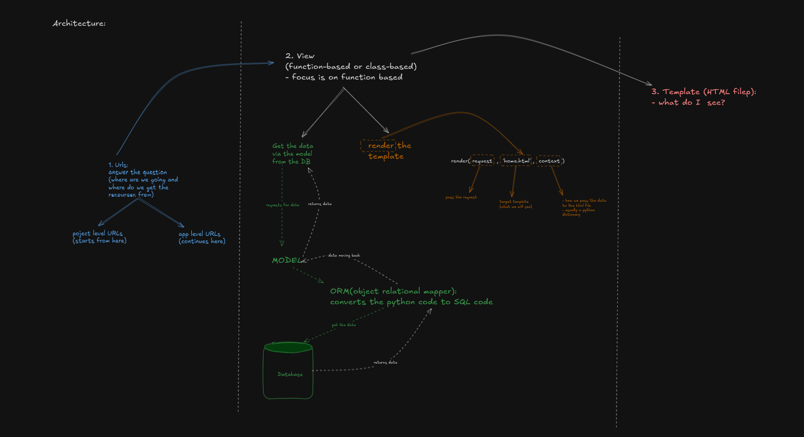
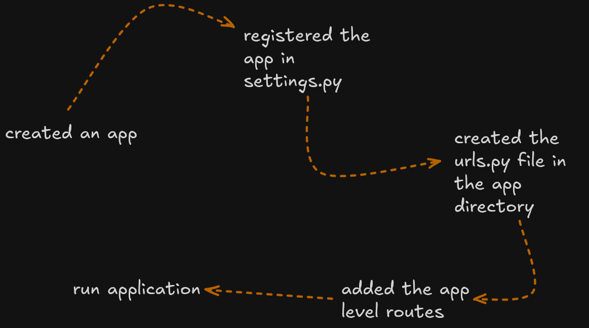
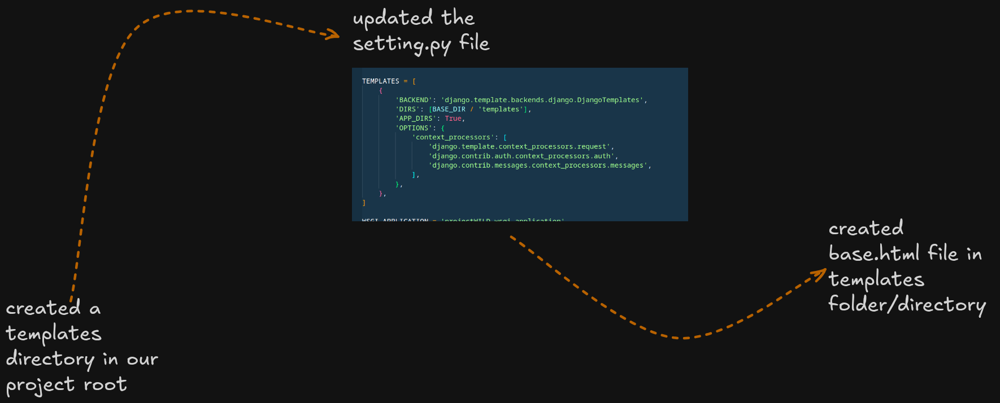
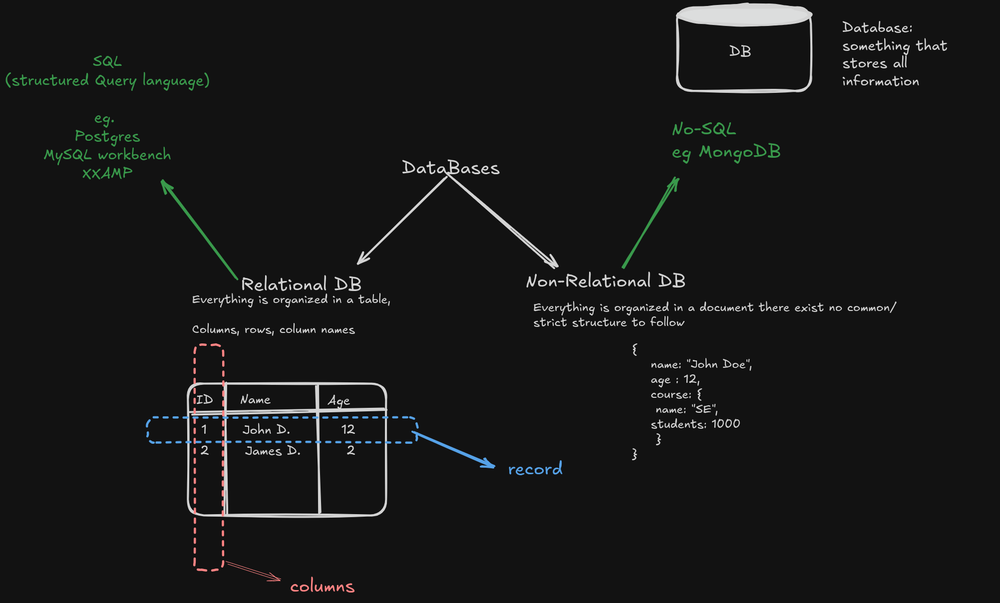
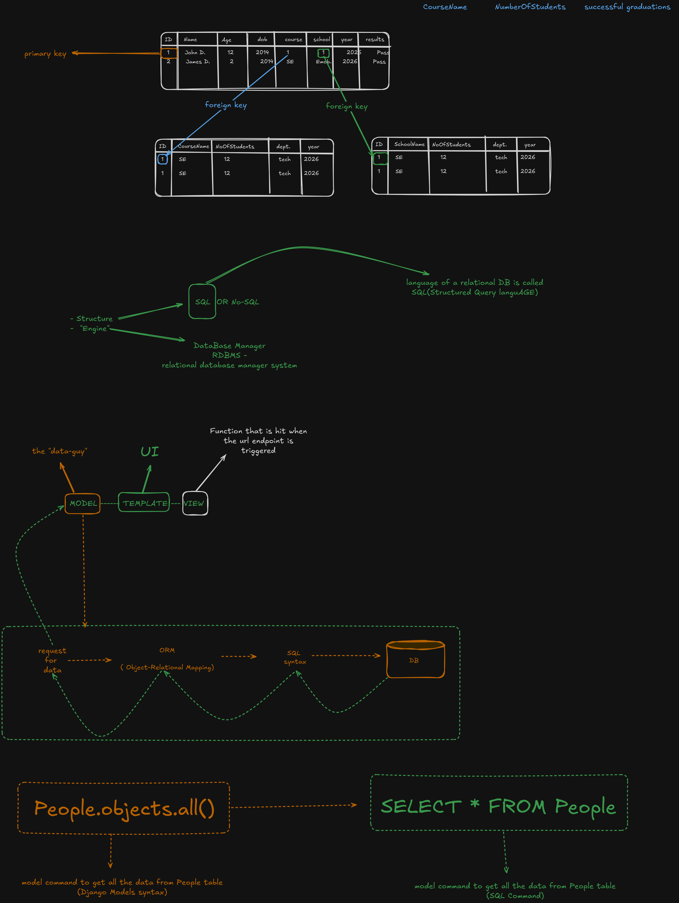

# DeepseekLab

## **Geneal Architecture**







## **Databases intro:**




## **Steps:**

- Create model for the table for instance we will create a table called 'plants'
- syntax: 
    ```
        class Plant(models.Model):
            # <!-- attributes of the model -->
    ```